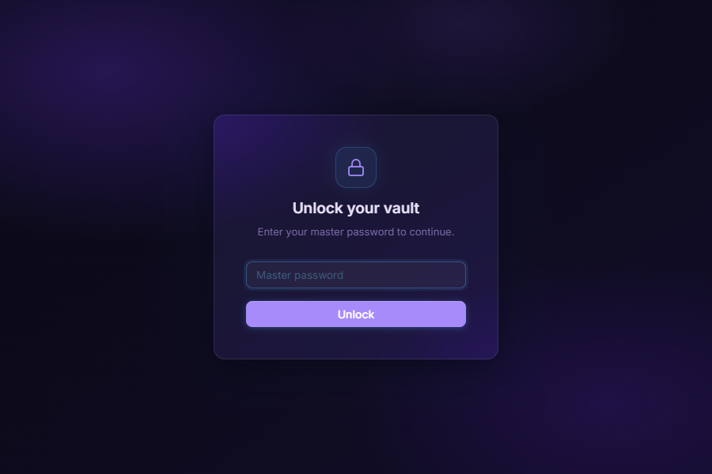
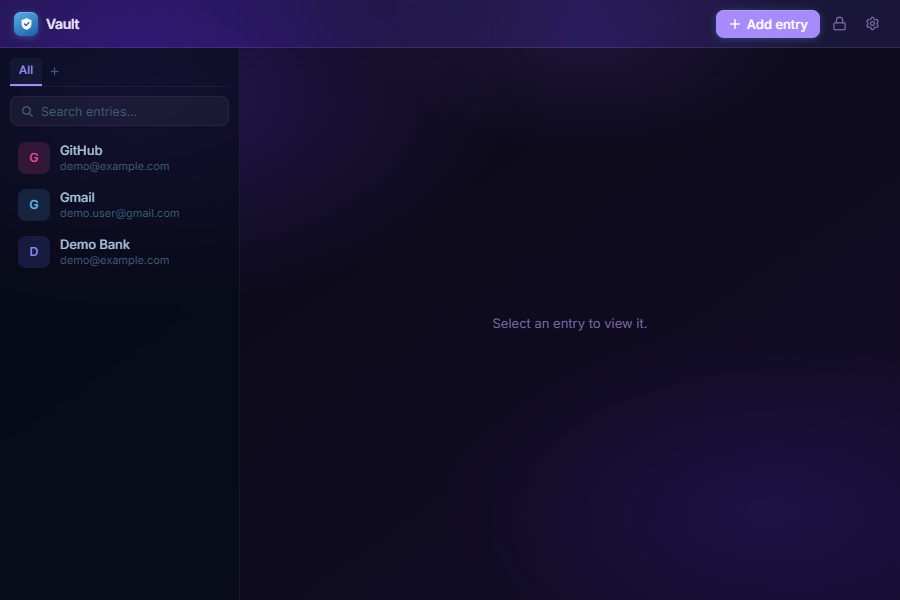
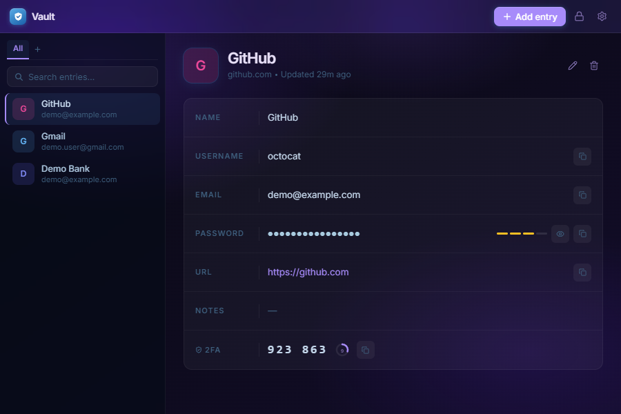
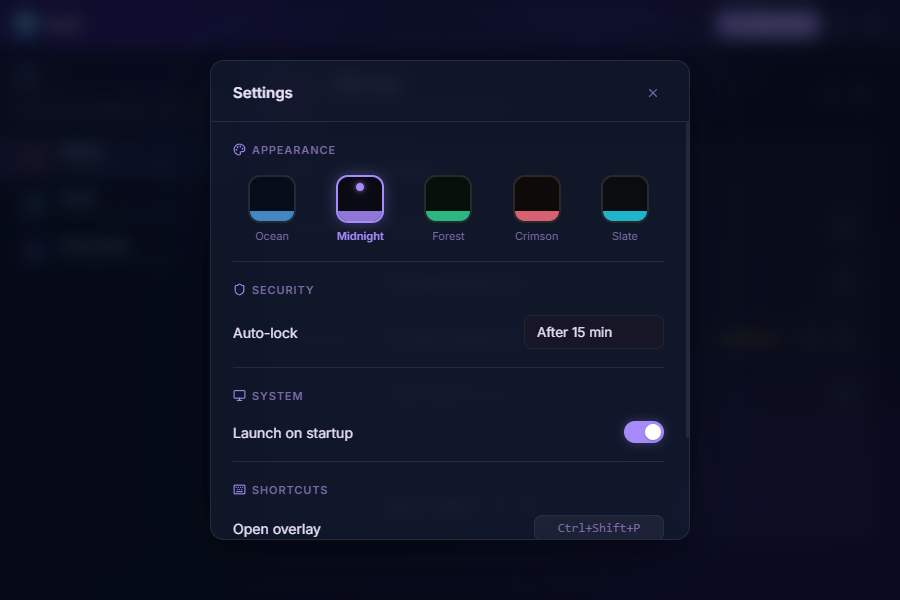
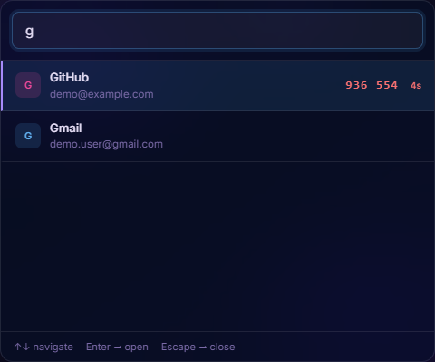
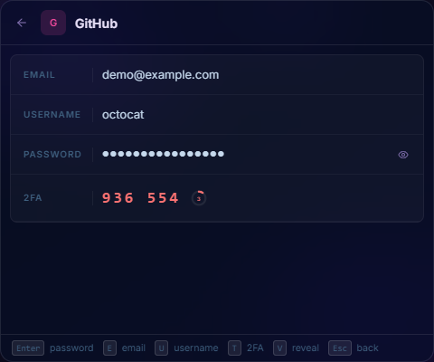

# Vault

A local, end-to-end encrypted password manager built with Tauri 2, React, and Rust.


---

## Features

- **AES-256-GCM encryption** — every vault is encrypted at rest with an authenticated cipher; nothing is ever stored in plaintext
- **Argon2id key derivation** — master password is stretched with Argon2id before use, making brute-force attacks expensive
- **Secure key wiping** — the decryption key is zeroed from memory on lock via the `zeroize` crate
- **TOTP / 2FA codes** — store a base32 TOTP secret per entry; live 6-digit codes with a countdown timer are shown in the detail view and inline in the overlay search list
- **System tray** — lives in the background; use the tray menu to open, lock, or quit
- **Quick-access overlay** — press a configurable global shortcut (default `Ctrl+Shift+P`) to open a floating search window; select an entry to view all fields and copy with keyboard shortcuts
- **Configurable overlay shortcut** — change the global keybind in Settings → Shortcuts; persisted across restarts
- **Auto-lock** — configurable inactivity timeout (1 min to 1 hour, or never)
- **Clipboard auto-clear** — copied secrets are wiped from the clipboard after 30 seconds via a system-level clear (no blank history entry added)
- **Folders** — organise entries into folders with rename and delete support
- **Themes** — multiple colour themes switchable from Settings
- **Autostart** — optional launch on system boot
- **Import / Export** — encrypted vault backups
- **Fully local** — no cloud, no sync, no telemetry

---

## Screenshots

### Lock Screen


### Main Window



### Settings


### Quick-Access Overlay



---

## Security Model

| Layer | Implementation |
|---|---|
| Key derivation | Argon2id — 64 MB memory, 3 iterations |
| Encryption | AES-256-GCM (authenticated) |
| Salt | 32 random bytes, generated once per vault |
| Nonce | 12 random bytes, unique per save |
| Storage | `Base64(nonce ‖ ciphertext)` written to disk |
| Memory | Master key zeroed with `zeroize` on lock |
| Clipboard | Cleared after 30 s via `arboard::Clipboard::clear()` |

The vault file cannot be decrypted without the master password. There is no recovery mechanism — if you forget your master password, the data is unrecoverable.

---

## Tech Stack

**Frontend**
- React 19 + TypeScript 5.8
- Vite 7
- Glassmorphism UI — no external component library

**Backend (Rust)**
- Tauri 2
- `aes-gcm` — encryption
- `argon2` — key derivation
- `arboard` — system clipboard access
- `zeroize` — secure memory wiping
- `uuid` — entry identifiers
- `serde_json` — vault serialization

---

## Entry Fields

| Field | Required |
|---|---|
| Name | Yes |
| Email | Yes |
| Password | Yes |
| Username | No |
| URL | No |
| Notes | No |
| 2FA secret | No |
| Folder | No |

---

## Installation

Download the latest installer from the [Releases](../../releases) page.

| File | Format |
|---|---|
| `Vault_1.0.0_x64-setup.exe` | NSIS installer (recommended) |
| `Vault_1.0.0_x64_en-US.msi` | MSI |

---

## Building from Source

**Prerequisites**
- [Node.js](https://nodejs.org) 18+
- [Rust](https://rustup.rs) stable
- [Tauri prerequisites](https://tauri.app/start/prerequisites/) — WebView2, MSVC build tools

```bash
git clone https://github.com/Wilgoy23/vault.git
cd vault
npm install
npm run tauri build
```

Installers are output to `src-tauri/target/release/bundle/`.

For development hot-reload:

```bash
npm run tauri dev
```

---

## Keyboard Shortcuts

### Main Window

| Shortcut | Action |
|---|---|
| `Ctrl+Shift+P` | Toggle quick-access overlay (configurable) |
| `J` / `↓` | Select next entry |
| `K` / `↑` | Select previous entry |
| `/` or `Ctrl+F` | Focus search |
| `E` | Edit selected entry |
| `Escape` | Deselect entry |

### Overlay — Search List

| Shortcut | Action |
|---|---|
| `↑` / `↓` | Navigate results |
| `Enter` | Open entry detail |
| `Escape` | Close overlay |

### Overlay — Entry Detail

| Shortcut | Action |
|---|---|
| `Enter` / `P` | Copy password |
| `E` | Copy email |
| `U` | Copy username |
| `T` | Copy 2FA code |
| `V` | Toggle password visibility |
| `Escape` | Back to search |

---

## License

MIT
